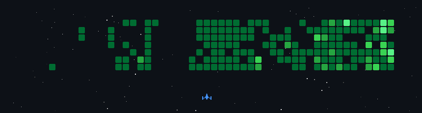

  

---

  <table>
    <tr>
      <td width="60%">
        🔭 I'm currently working on <strong>ML models from scratch</strong> and gaining real-world experience through <strong>internships</strong>  
        🌱 Actively learning <strong>Deep Learning</strong>, revisiting <strong>DSA</strong>, sharpening <strong>Python libraries</strong>, and building <strong>mathematical intuition for ML</strong>  
        💬 Ask me about <strong>Machine Learning, Data Analysis, or Python</strong>  
        🌍 Based in: <strong>Mumbai, India</strong>  
        📫 Reach me at: <strong>arwaghmode09@gmail.com</strong>
      </td>
      <td align="right">
        
      </td>
    </tr>
  </table>

---

### 🌐 Connect with me

  &nbsp;&nbsp;
  &nbsp;&nbsp;
  

---

### 🛠️ Tech Stack

**Languages**

<table>
  <tr>
    <td></td>
  </tr>
</table>

**Frameworks & Web**

<table>
  <tr>
    <td></td>
    <td></td>
    <td></td>
  </tr>
</table>

**Data Science & ML**

<table>
  <tr>
    <td></td>
    <td></td>
    <td></td>
    <td></td>
  </tr>
</table>

**Tools & Platforms**

<table>
  <tr>
    <td></td>
    <td></td>
    <td></td>
    <td></td>
    <td></td>
  </tr>
</table>

---

### 📊 GitHub Stats

  
  

  

---

### 📈 Recent Activity

  

---

### 🚀 A Bit More About Me

- 💡 I love turning raw ideas into working ML models — built from scratch, understood to the core
- 🤖 Endlessly fascinated by how mathematics and code together can simulate intelligence
- 🧠 Always going deeper — from strengthening DSA fundamentals to grasping the intuition behind every algorithm
- 📊 Data tells stories; I enjoy finding, telling, and visualizing them
- 🌍 Mumbai-based, curiosity-driven, and always experimenting

---

> _"In God we trust; all others bring data." — W. Edwards Deming_
